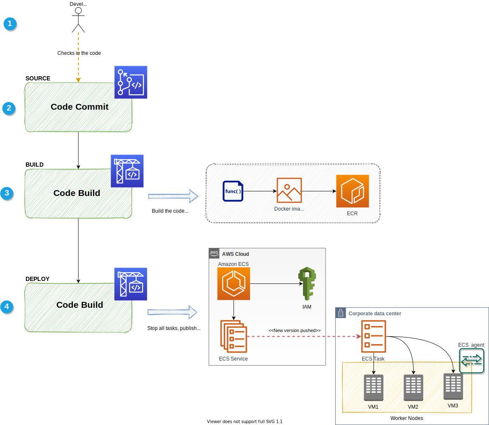
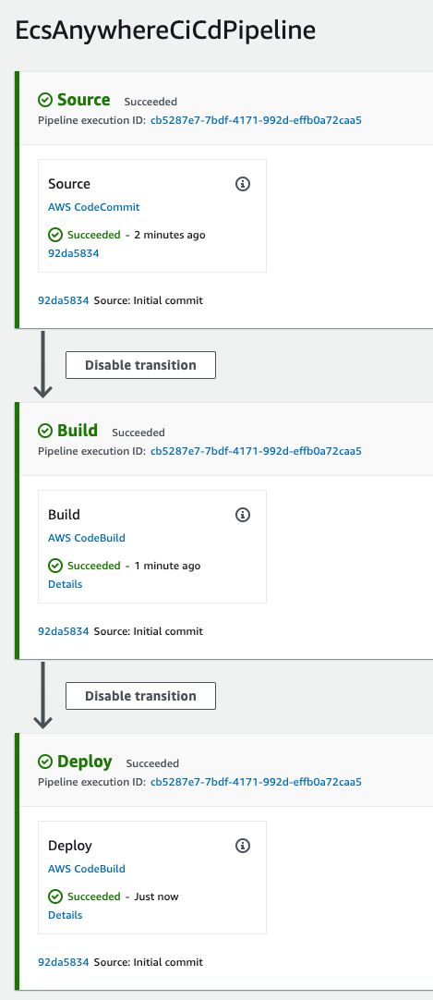
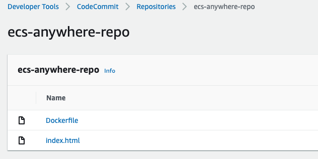

# CI/CD Pipeline for ECS-A

Part of this article lets see how we can create a continuous integration and delivery pipeline (CI/CD) for applications deployed outside AWS cloud using ECS-anywhere. We will use `CodeCommit`, `CodeBuild` and `CodePipeline` along with `AWS ECR` to build this pipeline.

## Usecase walkthrough

Here is the high level view of the pipeline, that we will build in this particle



**Notes:**

Here are the sequence of events:

1. Developer makes the required changes and checks in the code available in `AWS CodeCommit`
2. AWS will automatically trigger the code pipeline that's listening to the git branch
3. Part of this step, `AWS CodeBuild` will download the source, build the artifacts, create a docker image for the application, and push the artifacts to `AWS ECR`
4. `AWS CodeBuild` takes care of the following part of this step:
    * Creates a new revision of ECS task definition with the updated docker image tag
    * Updates the underlying ECS service with the new task definition
    * Stops all the running tasks, so ECS service can re-provision the ECS tasks with the latest version of the application

## Pre-requistes

* Setup the environment variables required to build ECS-anywhere cluster and run workloads using the newly created cluster.

> Note: Change the name of the CLUSTER_NAME and SERVICE_NAME if desired, for running multiple tests.

```bash
export AWS_DEFAULT_REGION=us-east-1
export ROLE_NAME=ecsMithrilRole
export CLUSTER_NAME=test-ecs-anywhere
export SERVICE_NAME=test-ecs-anywhere-svc
```

> Note: Change the value of AWS_DEFAULT_REGION to match the default AWS region.

* ECS cluster is up and running
* Vagrant VM is connected to ECS control plane and has the required network connectivity to access AWS cloud

## Step by step instruction

### Infrastructure setup

Run the following command from root directory to create the required AWS artifacts and the sample application

```bash
chmod +x *.sh
cd workload-management/cicd-deploy
./setup.sh
```

The above shell script takes care of creating the following artifacts and deploying the sample application using ECS-anywhere

* Creates a `AWS ECR` repository to host the docker image for the sample application
* Creates a `AWS CodeCommit` repository to host the source code for the sample application
* Creates two `AWS CodeBuild` projects (one to package the application and another to update the deployed application with the latest version)
* Creates a `AWS CodePipeline` listening to the changes to the `master` branch in the code repository
* Creates a `ECS Task` and `ECS Service` definition to deploy the sample application with `EXTERNAL` launch-type
* Creates all the required IAM roles & policies

> Note: Deploying this sample application will take sometime, so wait for couple of minutes before proceeding to next step

Here are some screenshots of the AWS artifact created by the shell script

#### AWS CodePipeline



#### AWS CodeCommit



### CI/CD in action

1. Open the browser and navigate to `http://localhost:8080`. We should see the below screenshot that shows the sample application is deployed.

    

2. Navigate to CodePipeline page in [AWS Console](https://console.aws.amazon.com/codesuite/codepipeline/pipelines/EcsAnywhereCiCdPipeline), you should see the code pipeline running. Part of the Deploy stage ECS task will be deployed to AWS ECS, so wait for couple of seconds after a successful execution of this stage before proceeding to next step.

3. We will make a small change to `index.html` and check-in the updated files to `AWS CodeCommit`. Navigate to gitrepo directory by running the following command:

    ```bash
    cd app/gitrepo
    ```

    Open `index.html` in your favorite text editor and update the text from `Hello world from ECS Anywhere!` to `New Hello world from ECS Anywhere!`. Save the file and run the following commands to push the changes back to `AWS CodeCommit`

    ```bash
    git add .
    git commit -m "Check in with new changes"
    git push
    cd ../..
    ```

    `EcsAnywhereCiCdPipeline` (AWS CodePipeline) will get automatically triggered (like below) and this will take care of building the application and deploying the changes

    

    > Note: Deploying the updated application will take sometime, so wait for couple of minutes before proceeding to next step. Use [AWS console](https://console.aws.amazon.com/codesuite/codepipeline/pipelines/EcsAnywhereCiCdPipeline) to check the status of the build and deploymen

4. Open the browser and navigate to this `http://localhost:8080`. We should see the below screenshot that shows the latest changes are successfully deployed

    

### Cleanup

Run the following command to delete all the AWS resources created for this article

```bash
./cleanup.sh
cd ../..
```

## Conclusion

This workload demostrates how easy is it to setup a CI/CD pipeline for applications running outside AWS cloud deployed using ECS-anywhere with the same set of fimilar tools.
