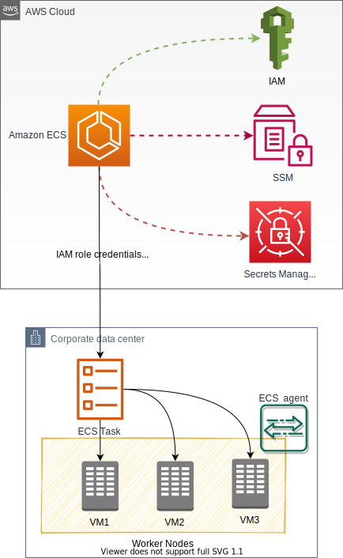
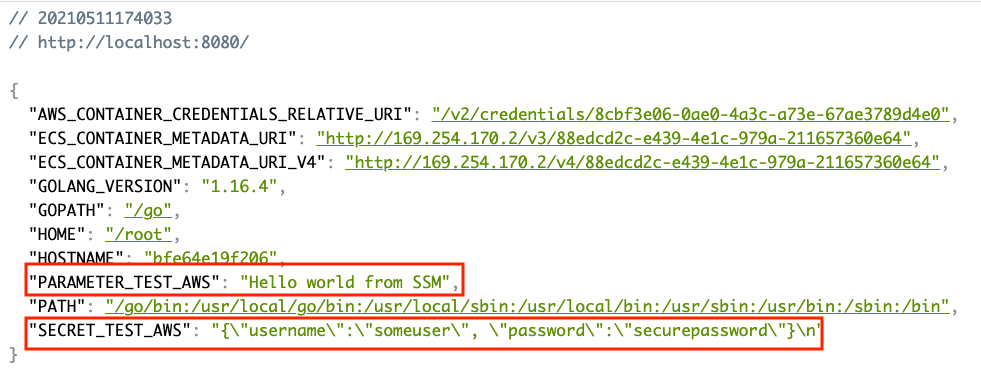

# Integrate with AWS Services

One of the common use case among customers running hybrid workloads is to keep configurations and secrets in AWS cloud and pull them on-demand when required. So part of this chapter lets see how we can integrate SSM parameter store and AWS Secrets manager with ECS tasks running outside AWS cloud.

## Usecase walkthrough

Here is the high level view architecture of the workload that we are going in this chapter



## Pre-requistes

* Setup the environment variables required to build ECS-anywhere cluster and run workloads using the newly created cluster.

> Note: Change the name of the CLUSTER_NAME and SERVICE_NAME if desired, for running multiple tests.

```bash
export AWS_DEFAULT_REGION=us-east-1
export ROLE_NAME=ecsMithrilRole
export CLUSTER_NAME=test-ecs-anywhere
export SERVICE_NAME=test-ecs-anywhere-svc
```

> Note: Change the value of AWS_DEFAULT_REGION to match the default AWS region.

* ECS cluster is up and running
* Vagrant VM is connected to ECS control plane and has the required network connectivity to access AWS cloud

## Summary

Here are the steps involved in running this workload:

* A new parameter is created in SSM parameter store with the name `PARAMETER_TEST_AWS`
* A new secret is created with the name `SECRET_TEST_AWS`
* Attach the required IAM policies to `ecsanywhereTaskExecutionRole` role, associated with the ECS task in order to access AWS Secrets manager, parameter store and AWS ECR
* A new ECS task definition is registered, part of which parameters and secrets gets injected as environment variables using `valueFrom` attribute
* A new ECS service registered to associate it with the ECS task created in previous step

## Step by step instruction

1. Navigate to the workload directory and execute `chmod` command to provide execute permissions on the shell scripts

    ```bash
    cd workload-management/ssm-secrets-manager
    chmod +x *.sh
    ```

2. Run the following command to setup environment variables required for this workload.

    ```bash
    source ./0-env.sh
    ```

3. Run the following command to create a new parameter in parameter store with the name `PARAMETER_TEST_AWS` and value `Hello world from SSM`

    ```bash
    ./1-create-parameter.sh
    ```

    **Output**

    ```bash
    Parameters created successfully
    ```

4. Run the following command to create a new secret in AWS secrets manager with the key `SECRET_TEST_AWS` and value `"{\"username\":\"someuser\", \"password\":\"securepassword\"}"`

    ```bash
    ./2-create-secrets.sh
    ```

    **Output**

    ```bash
    Secrets successfully created
    ```

5. Run the following command to create an ECR repository, build the ECS application and push it to ECR

    ```bash
    ./3-ecr-push.sh
    ```

    **Output**

    ```bash
    Login Succeeded
    [+] Building 0.9s (18/18) FINISHED
    => [internal] load build definition from Dockerfile                                                               0.0s
    => => transferring dockerfile: 839B                                                                               0.0s
    => [internal] load .dockerignore                                                                                  0.0s
    => => transferring context: 2B                                                                                    0.0s
    => [internal] load metadata for docker.io/library/golang:alpine                                                   0.0s
    => [internal] load build context                                                                                  0.0s
    => => transferring context: 14.13kB                                                                               0.0s
    => [builder 1/9] FROM docker.io/library/golang:alpine                                                             0.0s
    => CACHED [builder 2/9] RUN apk add --no-cache git                                                                0.0s
    => CACHED [builder 3/9] WORKDIR /app/ssm-secrets-manager                                                          0.0s
    => CACHED [builder 4/9] COPY go.mod .                                                                             0.0s
    => CACHED [builder 5/9] RUN export GOPROXY="direct"                                                               0.0s
    => CACHED [builder 6/9] RUN go env -w GOPRIVATE=*                                                                 0.0s
    => CACHED [builder 7/9] RUN go mod download                                                                       0.0s
    => [builder 8/9] COPY ../.. .                                                                                     0.0s
    => [builder 9/9] RUN go build -o ./out/ssm-secrets-manager main.go                                                0.7s
    => CACHED [stage-1 2/5] RUN apk add --no-cache         python3         py3-pip         ca-certificates     && pi  0.0s
    => CACHED [stage-1 3/5] COPY --from=builder /etc/passwd /etc/passwd                                               0.0s
    => CACHED [stage-1 4/5] COPY --from=builder /etc/group /etc/group                                                 0.0s
    => CACHED [stage-1 5/5] COPY --from=builder /app/ssm-secrets-manager/out/ssm-secrets-manager /main                0.0s
    => exporting to image                                                                                             0.0s
    => => exporting layers                                                                                            0.0s
    => => writing image sha256:6446ac065574cc49b3a5018ac2318d3b44b0b0486d4b4f52021df375941210c5                       0.0s
    => => naming to docker.io/library/go-sample-ssm-secrets-repo                                                      0.0s

    Use 'docker scan' to run Snyk tests against images to find vulnerabilities and learn how to fix them
    The push refers to repository [775492342640.dkr.ecr.us-east-1.amazonaws.com/go-sample-ssm-secrets-repo]
    b81b7e7097c8: Layer already exists
    391889d77512: Layer already exists
    b878da30d815: Layer already exists
    cab0017af15d: Layer already exists
    a9d40f605488: Layer already exists
    dc27f0c2b863: Layer already exists
    a588deb4bef3: Layer already exists
    224f6b2e3ad2: Layer already exists
    b2d5eeeaba3a: Layer already exists
    latest: digest: sha256:3446ff62c554c1c2d3adaa7f0d5659a9bc6cd79e9e1dd6f326d3769eb12c0e9d size: 2202
    ```

    > Note: Policies required to access `AWS SecretsManager`, `AWS ParameterStore` and `AWS ECR` are attached to the ECS task execution role

6. Run the following command to create a ECS task and associated it with a ECS service to run the workload in vagrant VM (outside AWS Cloud)

    ```bash
    ./4-ecs-task-service.sh
    ```

7. The task will take a bit of time to get started, so wait couple of seconds and then open the browser and navigate to this URL `http://localhost:8080`, to see the below response:

    

    > Note: Values in parameter store and secrets manager are available part of `PARAMETER_TEST_AWS` and `SECRET_TEST_AWS` environment variables.

8. Run the following command to cleanup all the resources created part of this article

    ```bash
    ./5-cleanup.sh
    cd ../..
    ```
